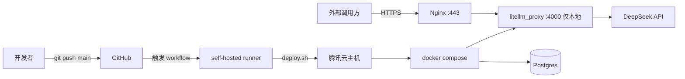

# 腾讯云 + GitHub Self-Hosted Runner 自动部署 LiteLLM

本目录提供一套可直接落地的部署脚本，适用于：

- 一台腾讯云 Linux 主机（推荐 `4C8G` 及以上）
- 主机上已装好 **Docker Engine + docker compose 插件**
- 主机上已装好并注册了 **GitHub Actions self-hosted runner**（runner 的默认 label 是 `self-hosted`）

主要目标：

- LiteLLM 作为网关，接入 **DeepSeek**（DeepSeek-V3 / DeepSeek-R1），并支持动态调整 **thinking level**
- **推送到 `main`** 且改动命中 `deploy/tencent/**` 时，由 self-hosted runner 自动更新线上服务

## 文件结构

```
deploy/tencent/
├── README.md                  # 本文档
├── litellm.config.yaml        # LiteLLM 模型配置（含 DeepSeek + reasoning_effort 预设；部署时会改名为 config.yaml）
├── docker-compose.prod.yml    # 生产 compose（仅绑定 127.0.0.1，通过 Nginx 对外）
├── .env.example               # 环境变量模板，真实 .env 只放服务器不进仓库
├── nginx.conf.example         # Nginx 反向代理 + HTTPS 模板
└── scripts/
    ├── bootstrap.sh           # 服务器一次性初始化
    ├── deploy.sh              # 部署脚本（workflow 调用）
    └── rollback.sh            # 回滚到指定镜像 tag
```

工作流文件：`.github/workflows/deploy-tencent.yml`

## 部署架构



## 一、服务器侧一次性准备

### 1) 安装 Docker 与 Compose 插件

以 Ubuntu 22.04 为例（腾讯云 TencentOS / CentOS 类似，参考官方文档）：

```bash
sudo apt-get update
sudo apt-get install -y ca-certificates curl gnupg
sudo install -m 0755 -d /etc/apt/keyrings
curl -fsSL https://download.docker.com/linux/ubuntu/gpg | sudo gpg --dearmor -o /etc/apt/keyrings/docker.gpg
sudo chmod a+r /etc/apt/keyrings/docker.gpg
echo \
  "deb [arch=$(dpkg --print-architecture) signed-by=/etc/apt/keyrings/docker.gpg] https://download.docker.com/linux/ubuntu \
  $(lsb_release -cs) stable" | sudo tee /etc/apt/sources.list.d/docker.list > /dev/null
sudo apt-get update
sudo apt-get install -y docker-ce docker-ce-cli containerd.io docker-compose-plugin
```

验证：

```bash
docker --version
docker compose version
```

### 2) 让 self-hosted runner 用户免 sudo 使用 docker

假设你的 runner 运行用户为 `ubuntu`（按实际替换）：

```bash
sudo usermod -aG docker ubuntu
# 重新登录或重启 runner 进程以生效
sudo systemctl restart actions.runner.*.service || true
```

### 3) 克隆仓库（首次需要，后续 runner 自己 checkout）

```bash
sudo mkdir -p /opt/src && sudo chown "$USER":"$USER" /opt/src
cd /opt/src
git clone https://github.com/AlataChan/litellm.git
cd litellm
```

### 4) 执行一次性初始化

```bash
sudo bash deploy/tencent/scripts/bootstrap.sh
```

它会：

- 创建 `/opt/litellm` 并把属主改成你当前的用户
- 校验 Docker 可用
- 从模板生成 `/opt/litellm/.env`（权限 `0600`）

### 5) 填写 `.env` 秘钥

```bash
vim /opt/litellm/.env
```

至少要改这些：

- `LITELLM_MASTER_KEY`：`openssl rand -hex 32` 生成
- `LITELLM_SALT_KEY`：同上
- `POSTGRES_PASSWORD`：自定义强密码
- `DEEPSEEK_API_KEY`：你的 DeepSeek Key

> `.env` 只存服务器、不进仓库。Runner 只改 `docker-compose.yml` 与 `config.yaml`，不会覆盖 `.env`。

### 6) 首次手动跑一次，确认能起来

```bash
cd /opt/src/litellm
bash deploy/tencent/scripts/deploy.sh
```

看到 `健康检查通过` 即成功。此时本机验证：

```bash
curl -s http://127.0.0.1:4000/health/liveliness
```

### 7) 配置 Nginx + HTTPS（对外暴露）

```bash
sudo apt-get install -y nginx certbot python3-certbot-nginx
sudo cp deploy/tencent/nginx.conf.example /etc/nginx/conf.d/litellm.conf
# 把 server_name 改成你的域名，nginx -t 检查后：
sudo nginx -t && sudo systemctl reload nginx
sudo certbot --nginx -d your-domain.example.com
```

腾讯云安全组放行 `80`、`443`；`4000` 不要对公网开。

## 二、GitHub 侧一次性准备

### 1) 确认 self-hosted runner 在线

仓库 -> Settings -> Actions -> Runners，状态应为 **Idle**。

### 2) （可选）给 runner 打自定义 label

如果你的 runner 机器不止一台，建议给这台腾讯云 runner 加个 label（比如 `tencent`），然后把 workflow 里的 `runs-on: self-hosted` 改成 `runs-on: [self-hosted, tencent]`，避免部署跑到别的机器。

### 3) 建立 `main` 分支

本仓库当前没有 `main`，我们会把 `litellm_internal_staging` 的一个快照推成 `main`，作为部署分支。之后所有部署变更都只在 `deploy/tencent/**` 下提交到 `main` 就行，不会触及 LiteLLM 主干。

## 三、日常使用

### 修改模型或参数

编辑 `deploy/tencent/litellm.config.yaml`（仓库根 `.gitignore` 忽略了 `config.yaml`，因此仓库里用这个名字，部署时再改名为 `config.yaml`），例如新增一个模型别名：

```yaml
- model_name: deepseek-reasoner-high-long
  litellm_params:
    model: deepseek/deepseek-reasoner
    api_key: os.environ/DEEPSEEK_API_KEY
    reasoning_effort: high
    max_tokens: 8192
```

提交并推送到 `main`：

```bash
git add deploy/tencent/litellm.config.yaml
git commit -m "chore(deploy): add high-long reasoner alias"
git push origin main
```

Runner 自动触发 `deploy-tencent` 工作流 -> `deploy.sh` -> 拉镜像 -> `up -d` -> 健康检查。

### 手动部署 / 紧急重启

GitHub 仓库 -> Actions -> `deploy-tencent` -> **Run workflow**，即可手动触发同一套脚本。

### 回滚

在服务器上：

```bash
bash /opt/src/litellm/deploy/tencent/scripts/rollback.sh v1.76.0-stable
```

会生成 `docker-compose.override.yml` 把 litellm 服务固定到指定镜像版本。想恢复到最新：

```bash
rm /opt/litellm/docker-compose.override.yml
cd /opt/litellm && docker compose pull && docker compose up -d
```

## 四、调用示例（thinking level）

通过别名选思考深度，无需改业务请求格式：

```bash
curl -X POST https://your-domain.example.com/v1/chat/completions \
  -H "Authorization: Bearer $LITELLM_MASTER_KEY" \
  -H "Content-Type: application/json" \
  -d '{
    "model": "deepseek-reasoner-high",
    "messages": [{"role": "user", "content": "请证明勾股定理"}]
  }'
```

也可以直接用原始模型 + 透传参数（因为 `drop_params: false`）：

```bash
curl -X POST https://your-domain.example.com/v1/chat/completions \
  -H "Authorization: Bearer $LITELLM_MASTER_KEY" \
  -H "Content-Type: application/json" \
  -d '{
    "model": "deepseek-reasoner",
    "reasoning_effort": "medium",
    "messages": [{"role": "user", "content": "你好"}]
  }'
```

## 五、排查清单

| 症状 | 排查 |
| --- | --- |
| runner 上工作流失败在 `deploy.sh` 的 `install` 步骤 | `/opt/litellm` 属主是否为 runner 用户 |
| 健康检查一直 404 / 502 | `docker compose logs litellm` 看 Prisma 迁移和启动日志 |
| `401 Invalid Key` | `.env` 中 `LITELLM_MASTER_KEY` 与调用时 `Authorization` 不一致 |
| DeepSeek 调用超时 | 腾讯云到 DeepSeek 网络波动，检查 `request_timeout` 或加 `num_retries` |
| UI 登录失败 | `.env` 里没设 `UI_USERNAME` / `UI_PASSWORD`，或需要重启 |

## 六、安全要点

- `.env` 只存服务器，权限 `0600`，不进仓库
- `4000` 端口只绑 `127.0.0.1`，外部经 Nginx + TLS
- 腾讯云安全组只开 `22/80/443`
- 定期更新镜像：`docker compose pull && docker compose up -d`
- `LITELLM_MASTER_KEY` 泄露后及时轮换并重启
